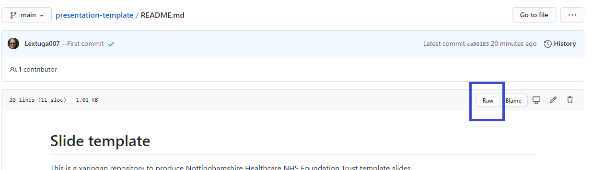

# Slide template

This is a xaringan repository to produce Nottinghamshire Healthcare NHS Foundation Trust template slides. 

### Viewing xaringan slides whilst building

Xaringan slides can be viewed in the viewer (in the bottom right hand of R Studio) live by typing

```
xaringan::inf_mr()
```

into the console. Any writing will appear automatically but for some other things, like adding images, once saved from the editor these update in the viewer. Knitting the document is also possible even with inf_mr() in use.

To stop (a message will appear with this information in the console), type

``` 
servr::daemon_stop(1)
```

or restart the R session with <kbd> Ctrl + Shift + F10 </kbd>. Note that if more than one session of inf_mr() has been started the daemon_stop() may be 2, or 3 and so on.

### Rendering

The slides will render in GitHub from the main branch if the repository is set to GitHub Pages are enabled. Go to Settings:


Standard setting are main and root in the selections. Note that it can take a few minutes for changes to be reflected in GitHub pages.

### Slide size

The slide size can be changed in the YAML from ratio: "16:9" to ratio: "4:3".

### Self-contained (html for sharing)

The slides have self_contained: true in the YAML so that just the html output can be emailed alone. Otherwise it will require the folder and files in libs, img and css to be shared along with the html.


### Linking and using the embedded slides

Xaringan slides can be embedded into urls. Using the GitHub link opens the slides in the web browser which is useful if resizing is required as opening the slides, as for Powerpoint, means the slides fill the whole screen.

https://cdu-data-science-team.github.io/presentation-template/index.html#1

Also, xaringan allows for slides to appear within a webpage and retain their interactivity so they can be viewed in the page (no requirement to open in another page):

<iframe src="https://cdu-data-science-team.github.io/presentation-template/index.html#1" width="600" height="400" loading="lazy" allowfullscreen></iframe> <script>fitvids('.shareagain', {players: 'iframe'});</script>

Note that this code will appear in the README.md as raw html but it does render if the README is rendered to README.html.

### Finding raw code for README

Code for embedding the xaringan slides in a webpage is in the [README file](https://raw.githubusercontent.com/CDU-data-science-team/presentation-template/main/README.md) which is located by going to the README.md and then clicking on the Raw button:



## Acknowledgements

Acknowledgements: the professional look of this presentation, using NHS and Nottinghamshire Healthcare NHS Foundation Trust colour branding, exists because of the amazing work of Silvia Canelón, details of the workshops she ran at the [NHS-R Community conference](https://spcanelon.github.io/xaringan-basics-and-beyond/index.html).

<a 
href="https://twitter.com/DataScienceNott" target="_blank"></a>

<a href="https://github.com/CDU-data-science-team" target="_blank"></a> 

<a 
href="mailto:zoe.turner2@notthc.nhs.uk" target="_blank"></a>


