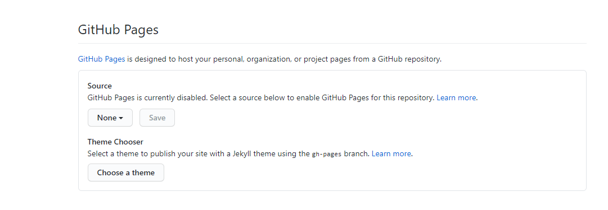

# Slide template

This is a xaringan repository to produce Nottinghamshire Healthcare NHS Foundation Trust template slides. 

## Rendering

The slides will render in GitHub from the main branch if the repository is set to GitHub Pages are enabled. Go to Settings:

Standard setting are main and docs in the selections.

## Acknowledgements

Acknowledgements: the professional look of this presentation, using NHS and Nottinghamshire Healthcare NHS Foundation Trust colour branding, exists because of the amazing work of Silvia Canelón, details of the workshops she ran at the [NHS-R Community conference](https://spcanelon.github.io/xaringan-basics-and-beyond/index.html).

[`r icon::fontawesome("twitter")` @DataScienceNott](https://twitter.com/DataScienceNott) 
[`r icon::fontawesome("github")` Clinical Development Unit Data Science Team](https://github.com/CDU-data-science-team) 
[`r icon::fontawesome("paper-plane")` zoe.turner2@notthshc.nhs.uk](mailto:zoe.turner2@nottshc.nhs.uk)

